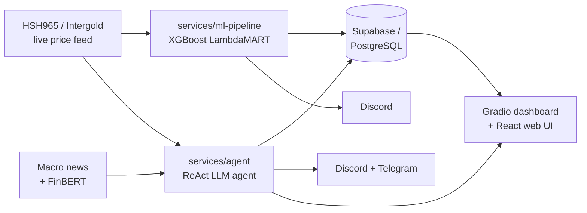

<div align="center">

<picture>
  <source media="(prefers-color-scheme: dark)" srcset="public/logo.png">
  <source media="(prefers-color-scheme: light)" srcset="public/logo.png">
  
</picture>

# 🏅 นักขุดทอง — Gold Trading AI Signal Generator


**Two independent signal engines — an XGBoost LambdaMART ranker and a ReAct LLM agent — that watch live HSH965 gold prices and tell a human *when* to buy or sell. It never places a trade for you.**

[](https://python.org)
[](https://xgboost.readthedocs.io)
[](https://fastapi.tiangolo.com)
[](https://gradio.app)
[](https://react.dev)
[](https://supabase.com)


**Course:** CN240 — Data Science for Signal Processing · Dept. of Computer Engineering, Thammasat University

[Overview](#-overview) · [Architecture](#%EF%B8%8F-architecture) · [Structure](#-repository-structure) · [Install](#-installation) · [Quick Start](#-quick-start) · [Config](#%EF%B8%8F-configuration) · [Team](#-team)

</div>

---

## 📌 Overview

**นักขุดทอง ("Gold Digger")** analyzes **HSH965** spot-gold prices and pushes **BUY / SELL / HOLD** signals to Discord and Telegram roughly every 10 minutes. The human reads the signal and makes the actual trade — **the system does not trade automatically.** It is tuned for retail gold traders on the Aom NOW platform operating on a fixed **฿1,500 capital / ฿1,400 position size**.

The repository ships **two independent systems** that can run side by side, so if one degrades the other keeps producing signals:

| | **`services/ml-pipeline`** (main) | **`services/agent`** (fallback) |
|---|---|---|
| **Approach** | Machine Learning — XGBoost LambdaMART ranker | ReAct LLM agent + news sentiment |
| **Model** | `lambdamart_v11` · 420 trees · M10 candles | Gemini / Groq + FinBERT |
| **Output** | BUY / SELL every 10 min | BUY / SELL / HOLD with written rationale |
| **Database** | Supabase (PostgreSQL) | PostgreSQL |
| **Notifications** | Discord webhook | Discord + Telegram |
| **Interface** | headless scheduler | Gradio dashboard + React web UI |

---

## 🏗️ Architecture



<p align="center">
  
  
</p>

### 1️⃣ `services/ml-pipeline` — XGBoost ML pipeline (main)

Streams live HSH965 ticks over WebSocket, builds M10 candles, engineers 40+ technical features, and scores each bar with a trained LambdaMART ranker. Every signal passes a state-guarded gate before being recorded and broadcast.

```text
HSH965 tick (WebSocket)
   ▼  [Phase 1] M10 Candle Builder      → OHLCV candles every 10 min
   ▼  [Phase 2] Feature Engine          → 40+ features (RSI, EMA, OLS slope, volume profile…)
   ▼  [Phase 3] LambdaMART v11          → XGBoost ranker · 420 trees · score → BUY / SELL
   ▼  [Phase 4] Signal Gate + State     → filtering + state guard (EMPTY / HOLDING)
   ▼  [Phase 5] Signal Recorder         → Supabase (signals, features, state) + Discord rationale
```

### 2️⃣ `services/agent` — ReAct LLM agent (fallback)

For each of 8 timeframes the agent runs a ReAct reasoning loop: the **Data Engine** gathers indicators + FinBERT news sentiment, the loop analyzes and debates through tool calls, and the **Risk Manager** validates the final decision before the votes are aggregated by weight (4h = 0.30 and 1h = 0.22 dominate).

```text
Market data (TwelveData / yfinance) + News (FinBERT sentiment)
   ▼  [data_engine]  Orchestrator      → indicators + sentiment + macro news
   ▼  [agent_core]   ReAct loop (LLM)  → SessionGate context → prompt → tool calls → ToolResultScorer
   ▼  [agent_core]   RiskManager       → validates TP/SL/position → BUY / SELL / HOLD + rationale
   ▼  Weighted vote across 8 timeframes
   ▼  PostgreSQL  +  Discord/Telegram  +  Gradio dashboard / React web UI
```

---

## 📂 Repository Structure

```text
นักขุดทอง/
├── services/
│   ├── ml-pipeline/                 # ⭐ Main — XGBoost LambdaMART pipeline (was Src_V4)
│   │   ├── core/                    #   candle_builder, feature_engine, model_inference,
│   │   │                            #   signal_gate, state_manager, dynamic_tp_manager
│   │   ├── db/                      #   Supabase schema + writer
│   │   ├── scheduler/               #   APScheduler orchestrator (M10 + heartbeat jobs)
│   │   ├── notifier/                #   Discord webhook
│   │   ├── rationale/               #   human-readable rationale generator
│   │   ├── monitoring/              #   pipeline health monitor
│   │   ├── models/                  #   lambdamart_v11.json (+ _meta.json)
│   │   ├── main.py · run_pipeline_once.py
│   │   └── requirements.txt
│   │
│   └── agent/                       # Fallback — ReAct LLM agent (was Src)
│       ├── agent_core/              #   react.py, prompt.py, risk.py, session_gate.py, llm/client.py
│       │   └── config/              #   roles.json (all trading rules) · skills.json
│       ├── data_engine/             #   orchestrator, gold_interceptor_lite (WebSocket),
│       │   │                        #   tools/ (registry, scorer), analysis_tools/, extract_features
│       ├── engine/engine.py         #   WatcherEngine — event-driven RSI trigger + trailing stop
│       ├── backtest/                #   CSV orchestrator, metrics, 7-check deploy gate
│       ├── notification/            #   Discord + Telegram notifiers
│       ├── ui/                      #   Gradio multi-page dashboard (navbar pages)
│       ├── frontend/                #   React + TypeScript + Vite + Tailwind web UI
│       │   └── api/main.py          #   Nakkhutthong FastAPI (psycopg2 → PostgreSQL)
│       ├── main.py · emergency_buy.py · emergency_sell.py
│       └── requirements.txt · about_src.md
│
├── docs/                            # notebooks, papers, presentations, architecture images
├── data/                            # raw market CSVs (XAUUSD / USDTHB / VIX)
├── archive/                         # src-v2/, news-api-backtest/ (kept for reference)
├── Data_and_Model_ML/               # local-only MLOps: training, datasets, venvs (git-ignored, ~17 GB)
├── public/logo.png
└── README.md · CLAUDE.md · requirements.txt
```

> 🧠 `Data_and_Model_ML/` holds the offline training notebooks, raw datasets, and fine-tuning environments that **produce** `lambdamart_v11.json`. It is multi-GB and intentionally **git-ignored** — keep it local or store it on Drive / Hugging Face.

---

## ⚙️ Trading Rules

These are hardcoded rules (in `services/agent/agent_core/config/roles.json`), not learned behavior:

| Rule | Detail |
|---|---|
| **Position size** | Always ฿1,400 (Aom NOW minimum) |
| **Dead zone** | No trading **02:00–06:14** Bangkok time |
| **BUY** | cash ≥ ฿1,408, not holding, **≥2 of 3** bullish (RSI 40–60, MACD > 0, Price > EMA20), confidence ≥ 0.75 |
| **Take-Profit** | PnL ≥ +฿300 · or +฿150 & RSI > 65 · or +฿100 & MACD hist < 0 |
| **Stop-Loss** | PnL ≤ −฿150 · or −฿80 & RSI < 35 · or force-close 01:30–01:59 if holding |
| **Sessions (weekday)** | night 00:00–01:59 · morning 06:15–11:59 · noon 12:00–17:59 · evening 18:00–23:59 (weekend 09:30–17:30) |
| **WatcherEngine** | trailing SL locks profit at cost + ฿5/g once profit ≥ ฿20/g · hard SL at ฿15/g loss |

---

## 🧮 Feature Engineering (ml-pipeline)

40+ features are computed from each M10 candle:

| Group | Features |
|---|---|
| **Trend** | EMA(9), EMA(21), EMA(50), OLS slope |
| **Momentum** | RSI(14), MACD, Stochastic |
| **Volatility** | ATR(14), Bollinger Band width |
| **Volume** | volume profile, VWAP deviation |
| **Pattern** | candle body ratio, wick ratio, gap |
| **Context** | trading session, day of week |

---

## 🔧 Tech Stack

| | `services/ml-pipeline` | `services/agent` |
|---|---|---|
| **Model / ML** | `xgboost` (LambdaMART), `scikit-learn`, `scipy` | `xgboost`, FinBERT via `transformers` |
| **LLM** | — | `google-genai`, `groq`, `anthropic`, `openai`, `mistralai`, `ollama` |
| **Data** | `pandas`, `numpy`, `websockets` | `pandas`, `numpy`, `pandas-ta`, `yfinance` |
| **Scheduling** | `APScheduler` 3.10 | event-driven `WatcherEngine` |
| **Backend / UI** | `httpx`, `structlog` | `fastapi`, `gradio`, React + Vite + Tailwind |
| **Database** | `supabase` 2.30 | `psycopg2-binary`, `supabase` |
| **Notify** | Discord webhook | Discord + Telegram |

---

## 📦 Installation

**Prerequisites:** Python **3.11+**, a PostgreSQL/Supabase database, a Discord webhook, and Node.js (only for the React frontend).

```bash
git clone https://github.com/athiphat67/CN240_DATA-SCIENCE-FOR-SIGNAL-PROCESSING_PROJECT.git
cd CN240_DATA-SCIENCE-FOR-SIGNAL-PROCESSING_PROJECT
```

```bash
# ── ML pipeline (main) ──────────────────────────────────────────
cd services/ml-pipeline
python3.11 -m venv venv && source venv/bin/activate
pip install -r requirements.txt
cp .env.example .env          # fill in Supabase + Discord credentials
```

```bash
# ── ReAct agent (fallback) ──────────────────────────────────────
cd services/agent
python3.11 -m venv venv && source venv/bin/activate
pip install -r requirements.txt
cp .env.example .env          # fill in LLM keys + DATABASE_URL + TwelveData
```

---

## 🚀 Quick Start

```bash
# Run the ML pipeline once (dry run — no DB writes, no orders)
cd services/ml-pipeline
DRY_RUN=true python run_pipeline_once.py
```

```bash
# One-shot LLM analysis (no live fetch required)
cd services/agent
python main.py --provider gemini --skip-fetch
```

```bash
# Launch the Gradio dashboard → http://0.0.0.0:10000
cd services/agent && python ui/dashboard.py
```

---

## 🛠️ Usage

**1. Backtest the agent against historical candles**

```bash
cd services/agent
python backtest/run_main_backtest.py --provider gemini --timeframe 1h --days 30
```

**2. Run the event-driven watcher (RSI-triggered loop)**

```bash
cd services/agent
python engine/engine.py
```

**3. Serve + develop the React web UI**

```bash
# FastAPI backend for the React UI (Nakkhutthong API)
cd services/agent
uvicorn frontend.api.main:app --host 0.0.0.0 --port 8000

# Vite dev server (separate terminal)
cd services/agent/frontend
npm install
npm run dev          # also: npm run build / npm run preview
```

**4. Run the ML pipeline live**

```bash
cd services/ml-pipeline
python main.py       # APScheduler-driven M10 + heartbeat jobs
```

---

## ⚙️ Configuration

Copy `services/agent/.env.example` → `.env`. **At least one LLM provider key is required.**

| Variable | Description | Default | Required |
|---|---|---|---|
| `GEMINI_API_KEY` | Google Gemini key (ReAct agent) | — | ✅ one LLM key |
| `GROQ_API_KEY` | Groq key (fallback provider) | — | ⬜ |
| `OPENROUTER_API_KEY` | OpenRouter key | — | ⬜ |
| `TWELVEDATA_API_KEY` | Market data (OHLCV) | — | ✅ |
| `DATABASE_URL` | PostgreSQL connection string | — | ✅ |
| `SUPABASE_URL` / `SUPABASE_KEY` | Supabase project (ML system DB) | — | ✅ |
| `DISCORD_WEBHOOK_URL` | Discord webhook for signals | — | ✅ |
| `DISCORD_NOTIFY_ENABLED` | Toggle Discord notifications | `true` | ⬜ |
| `DISCORD_NOTIFY_MIN_CONF` | Min confidence to notify | `0.7` | ⬜ |
| `TELEGRAM_BOT_TOKEN` / `TELEGRAM_CHAT_ID` | Telegram delivery | — | ⬜ |
| `HF_TOKEN` / `HUGGINGFACE_API_KEY` | FinBERT model access | — | ⬜ |
| `LOG_LEVEL` | Logging verbosity | `INFO` | ⬜ |
| `PORT` | Gradio / UI port | `10000` | ⬜ |
| `VITE_API_URL` | Frontend → API base URL | `http://localhost:8000` | ⬜ |

---

## 🚢 Deployment

Each service is deployed independently and the deploy configs use paths **relative to each service root**, so they keep working after the restructure — **but the "Root Directory" must be updated in each hosting dashboard:**

| Target | Config file | Set the platform root directory to |
|---|---|---|
| Agent backend (Railway/Render) | `services/agent/Dockerfile` | `services/agent` |
| React UI backend | `services/agent/Dockerfile.frontend` · `frontend/Procfile` | `services/agent` (build) / `services/agent/frontend` |
| React UI (Vercel) | `services/agent/frontend/vercel.json` | `services/agent/frontend` |

---

## 🗺️ Roadmap

- ✅ Real-time HSH965 WebSocket interceptor with auto-reconnect
- ✅ Backtest harness with 7-check deploy gate
- ✅ Telegram notifier alongside Discord
- ✅ Monorepo restructure (`services/` + `docs/` + `archive/`)
- 📅 Add a CI workflow + automated test suite
- 📅 Publish a hosted live dashboard demo + screenshots
- 📅 Add a LICENSE file and a download script for `Data_and_Model_ML/`

---

## 📚 Documentation

| Topic | Link |
|---|---|
| Agent architecture (deep dive) | [services/agent/about_src.md](services/agent/about_src.md) |
| ML architecture | [services/ml-pipeline/hsh_ml_trading_architecture_v4.md](services/ml-pipeline/hsh_ml_trading_architecture_v4.md) |
| Feature engineering | [docs/Phase2_FeatureEngineering.ipynb](docs/Phase2_FeatureEngineering.ipynb) · [docs/Phase2_EDA.ipynb](docs/Phase2_EDA.ipynb) |
| Presentations & papers | [docs/Presentations/](docs/Presentations) · [docs/Papers/](docs/Papers) |

---

## 🤝 Contributing

Contributions and ideas are welcome — open an issue or PR. Keep the UI/API layers free of business logic (it lives in `agent_core/` and `core/`), put each service's deps in its own `requirements.txt`, and never commit anything under `Data_and_Model_ML/` or local `venv/`. <!-- TODO: add CONTRIBUTING.md --> A `CONTRIBUTING.md` is not yet present.

---

## ⚠️ License & Disclaimer

<!-- TODO: no LICENSE file found in the repository -->
No `LICENSE` file is present. This project is for **academic use only** (CN240, Thammasat University) and is **not financial or investment advice** — gold trading carries high risk and users are fully responsible for their own decisions.

---

## 👥 Team

| Name | Student ID | | Name | Student ID |
|---|---|---|---|---|
| Athiphat Sunsit | 6710615292 | | Benchaphon Pinakasa | 6710625028 |
| Purich Ampawa | 6710615185 | | Lalita Thatsananunchai | 6710615243 |
| Theepop Rattanasubsiri | 6710685014 | | Phatcharaphon Malaisri | 6710685055 |
| Chotiwit Daugstan | 6710615060 | | Sitthipong Kamngam | 6710615284 |
| Napattira Loaklemhung | 6710545010 | | Panithan Tuntue | 6710615144 |

---

<div align="center">

**Department of Computer Engineering · Thammasat University · 2026**

<sub>Built with XGBoost · FastAPI · Gradio · React · Supabase · FinBERT · Gemini / Groq</sub>

</div>
